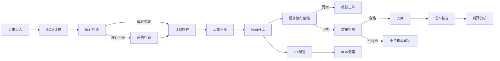

## 1. 产品概述

离散型工厂MES（制造执行系统）生产执行系统，覆盖订单录入、计划排程、生产执行、质量管理、仓储物流、能耗管理、成本核算、车间看板全流程，实现生产全链路数字化管控。

- 主要解决：离散制造业生产过程不透明、计划排程效率低、质量追溯难、成本核算不准等痛点
- 目标用户：操作工、班组长、车间主任、厂长四级角色的生产管理人员
- 产品价值：提升OEE设备综合效率15%+，缩短生产周期20%，降低不良品率30%

## 2. 核心功能

### 2.1 用户角色

| 角色 | 注册方式 | 核心权限 |
|------|----------|----------|
| 操作工 | 管理员创建 | 扫码开工、完工上报、异常上报、查看本人工单 |
| 班组长 | 管理员创建 | 工单管理、人员排班、异常处理、班组看板 |
| 车间主任 | 管理员创建 | 计划排程、质量管控、成本分析、车间看板 |
| 厂长 | 管理员创建 | 全模块权限、决策分析、利润报表、全厂看板 |

### 2.2 功能模块

1. **登录页**：角色选择登录、权限验证
2. **车间大屏看板**：OEE、产量达成率、不良率实时展示，支持钻取
3. **订单管理**：订单录入、BOM自动计算、库存检查、采购申请触发
4. **生产计划**：设备负荷排程、交期优化、工单生成与下发
5. **生产执行**：扫码开工、设备参数采集、异常停机维修工单
6. **质量管理**：机器视觉检测、不合格品锁定、质量追溯
7. **仓储物流**：JIT配送、AGV调度、库存管理
8. **能耗管理**：电耗监控、超标预警、能耗分析
9. **成本核算**：工单成本核算、利润分析表
10. **系统管理**：用户权限、基础数据配置

### 2.3 页面详情

| 页面名称 | 模块名称 | 功能描述 |
|----------|----------|----------|
| 登录页 | 身份认证 | 账号密码登录、角色选择、记住登录 |
| 车间大屏 | 数据看板 | OEE环形图、产量进度条、不良率趋势、设备状态矩阵、实时告警滚动 |
| 订单列表 | 订单管理 | 订单增删改查、BOM展开查看、库存状态标识、采购申请关联 |
| 订单录入 | 订单管理 | 产品选择、数量录入、交期设置、BOM自动计算预览 |
| 生产计划 | 计划排程 | 甘特图排程、设备负荷热力图、交期预警、工单下发 |
| 工单管理 | 生产执行 | 工单列表、扫码开工、完工确认、进度跟踪 |
| 设备监控 | 生产执行 | 设备运行参数（温度、转速）实时曲线、异常报警 |
| 质量检验 | 质量管理 | 视觉检测结果、缺陷分类、不合格品处理、质量统计 |
| 仓储管理 | 仓储物流 | 库存查询、JIT配送单、AGV任务状态、物料追溯 |
| 能耗监控 | 能耗管理 | 设备电耗排行、实时功率曲线、超标预警记录 |
| 成本核算 | 成本分析 | 工单成本明细、利润分析、成本趋势对比 |
| 系统设置 | 系统管理 | 用户管理、角色权限、基础数据配置 |

## 3. 核心流程

### 3.1 订单到生产主流程

客户订单录入 → BOM自动展开计算原料需求 → 库存检查 → 库存不足触发采购申请 → 生产计划排程（设备负荷+交期优化）→ 生成工单下发机台 → 工人扫码开工 → 设备参数实时采集 → 异常停机触发维修工单 → 机器视觉质检 → 不合格品自动锁定 → JIT物料配送 → AGV搬运 → 月末成本核算 → 利润分析

## 4. 用户界面设计

### 4.1 设计风格

- **主色调**：工业蓝 #165DFF 为主色，搭配深灰 #1D2129 背景，营造专业工业感
- **强调色**：成功绿 #00B42A、警示橙 #FF7D00、危险红 #F53F3F，用于状态标识
- **设计风格**：工业科技风，深色主题，数据可视化突出，信息密度高但层次清晰
- **字体**：JetBrains Mono 等宽字体用于数据展示，Inter 用于界面文字
- **布局**：左侧导航 + 顶部状态栏 + 主内容区的经典后台布局
- **卡片风格**：半透明玻璃拟态卡片，带微光边框，科技感强

### 4.2 页面设计概览

| 页面名称 | 模块名称 | UI元素 |
|----------|----------|--------|
| 车间大屏 | 数据看板 | 大字号数据指标、环形OEE图表、设备状态矩阵、实时告警滚动条、数据刷新动画 |
| 订单管理 | 数据表格 | 高级搜索栏、状态标签、BOM展开详情、库存充足/不足标识 |
| 生产计划 | 甘特图 | 时间轴、设备行、拖拽调整、负荷颜色梯度、交期预警线 |
| 设备监控 | 实时曲线 | 多参数曲线图、阈值警戒线、设备状态指示灯、异常弹窗 |
| 质量检验 | 检测结果 | 视觉检测缩略图、缺陷标注、不合格品锁定按钮、质量趋势图 |

### 4.3 响应式

- 桌面端优先设计，适配1920x1080及以上分辨率
- 车间大屏支持全屏展示，适配多种尺寸显示屏
- 移动端适配核心功能（扫码、工单查看）

### 4.4 数据可视化

- OEE使用环形进度图，三色分区表示合格/警告/危险
- 设备负荷使用热力图，颜色深浅表示负荷率
- 实时数据使用流动动画效果，增强数据鲜活感
- 告警信息使用脉冲闪烁动画提醒
