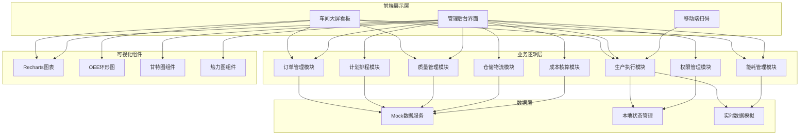
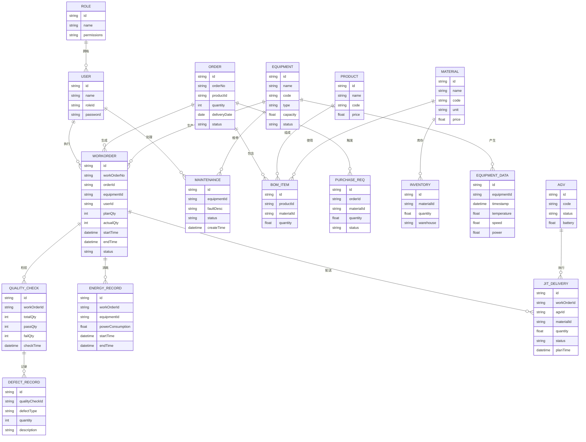

## 1. 架构设计



## 2. 技术说明

- **前端框架**: React@18 + TypeScript
- **构建工具**: Vite@5
- **样式方案**: TailwindCSS@3
- **状态管理**: React Context + useReducer
- **路由管理**: React Router@6
- **图表库**: Recharts@2
- **图标库**: Lucide React
- **UI组件**: 自定义组件库（工业风格）
- **数据方案**: Mock数据 + 实时数据模拟
- **动画库**: Framer Motion

## 3. 路由定义

| 路由 | 页面 | 权限 |
|------|------|------|
| /login | 登录页 | 公开 |
| /dashboard | 车间大屏看板 | 全员 |
| /orders | 订单管理 | 车间主任/厂长 |
| /orders/new | 订单录入 | 车间主任/厂长 |
| /planning | 生产计划排程 | 车间主任/厂长 |
| /workorders | 工单管理 | 操作工/班组长/车间主任 |
| /equipment | 设备监控 | 班组长/车间主任 |
| /quality | 质量检验 | 班组长/车间主任 |
| /warehouse | 仓储物流 | 班组长/车间主任 |
| /energy | 能耗管理 | 车间主任/厂长 |
| /cost | 成本核算 | 厂长 |
| /settings | 系统设置 | 厂长 |

## 4. 数据模型

### 4.1 数据模型定义



### 4.2 核心数据结构TypeScript定义

```typescript
// 用户与权限
interface User {
  id: string;
  name: string;
  roleId: RoleType;
  avatar?: string;
}

type RoleType = 'operator' | 'teamLeader' | 'workshopDirector' | 'factoryManager';

// 订单
interface Order {
  id: string;
  orderNo: string;
  productId: string;
  productName: string;
  quantity: number;
  deliveryDate: string;
  status: 'pending' | 'scheduled' | 'producing' | 'completed' | 'closed';
  createdAt: string;
}

// BOM物料清单
interface BOMItem {
  id: string;
  materialId: string;
  materialName: string;
  materialCode: string;
  unit: string;
  quantityPerUnit: number;
  totalQuantity: number;
  inventoryQty: number;
  shortageQty: number;
}

// 工单
interface WorkOrder {
  id: string;
  workOrderNo: string;
  orderId: string;
  orderNo: string;
  productName: string;
  equipmentId: string;
  equipmentName: string;
  operatorId?: string;
  operatorName?: string;
  planQty: number;
  completedQty: number;
  startTime?: string;
  endTime?: string;
  planStartTime: string;
  planEndTime: string;
  status: 'pending' | 'running' | 'paused' | 'completed' | 'abnormal';
}

// 设备
interface Equipment {
  id: string;
  name: string;
  code: string;
  type: string;
  status: 'running' | 'idle' | 'maintenance' | 'fault';
  currentTemperature: number;
  currentSpeed: number;
  currentPower: number;
  oee: number;
}

// 设备实时数据
interface EquipmentData {
  timestamp: string;
  temperature: number;
  speed: number;
  power: number;
}

// 质量检验
interface QualityCheck {
  id: string;
  workOrderId: string;
  workOrderNo: string;
  totalQty: number;
  passQty: number;
  failQty: number;
  passRate: number;
  checkTime: string;
  defects: DefectRecord[];
}

// 能耗记录
interface EnergyRecord {
  id: string;
  equipmentId: string;
  equipmentName: string;
  date: string;
  powerConsumption: number;
  standardConsumption: number;
  isOverLimit: boolean;
}

// 成本核算
interface WorkOrderCost {
  id: string;
  workOrderNo: string;
  productName: string;
  quantity: number;
  materialCost: number;
  laborCost: number;
  energyCost: number;
  totalCost: number;
  revenue: number;
  profit: number;
  profitMargin: number;
}
```

## 5. 核心模块设计

### 5.1 订单管理模块
- BOM展开算法：递归展开多级BOM，汇总各层级物料需求
- 库存检查：实时比对库存与需求，自动计算缺口
- 采购申请触发：库存不足时自动生成采购申请单

### 5.2 计划排程模块
- 设备负荷计算：基于设备产能和已分配工单计算负荷率
- 交期优先排程算法：EDD（最早交期优先）+ 设备负荷均衡
- 甘特图可视化：时间轴展示，支持拖拽调整

### 5.3 生产执行模块
- 扫码开工：模拟扫码验证工单，记录开工时间
- 实时数据模拟：定时器模拟设备温度、转速、功率数据
- 异常检测：阈值判断，超限时自动生成维修工单

### 5.4 质量管理模块
- 视觉检测模拟：随机生成检测结果和缺陷类型
- 不合格品管理：自动锁定，记录缺陷原因
- 质量统计：不良率、缺陷类型分布统计

### 5.5 能耗管理模块
- 实时功率监控：模拟实时功率曲线
- 超标预警：超过设定阈值触发告警
- 能耗统计：按设备、按时间维度统计分析

### 5.6 成本核算模块
- 成本归集：材料成本 + 人工成本 + 能耗成本
- 利润计算：收入 - 成本 = 利润
- 利润率分析：多角度成本结构分析

## 6. 项目目录结构

```
src/
├── assets/              # 静态资源
├── components/          # 通用组件
│   ├── layout/         # 布局组件
│   ├── charts/         # 图表组件
│   ├── ui/             # UI基础组件
│   └── common/         # 通用业务组件
├── pages/              # 页面组件
│   ├── Login/
│   ├── Dashboard/
│   ├── Orders/
│   ├── Planning/
│   ├── WorkOrders/
│   ├── Equipment/
│   ├── Quality/
│   ├── Warehouse/
│   ├── Energy/
│   ├── Cost/
│   └── Settings/
├── mock/               # Mock数据
├── hooks/              # 自定义Hooks
├── context/            # Context状态管理
├── utils/              # 工具函数
├── types/              # TypeScript类型定义
├── App.tsx
├── main.tsx
└── index.css
```
